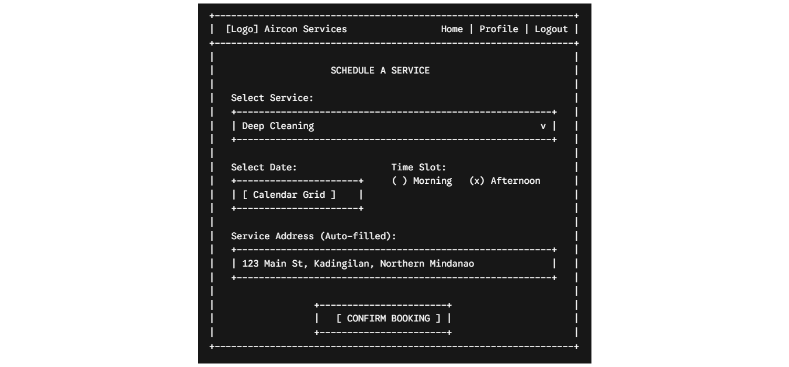
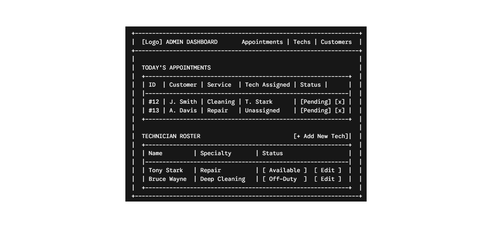
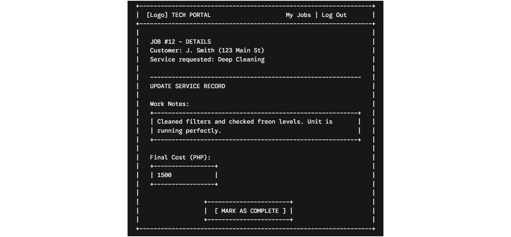

# Wireframes and Story Mapping

## 1. Customer Booking Form

**Mapped to User Stories:**
* **Appointments (Create):** Customer selecting date, time, and service type.
* **Services (Read):** Customer viewing the dropdown of available services.
* **Customers (Read):** System fetching and displaying the customer's address.

## 2. Admin Dashboard

**Mapped to User Stories:**
* **Appointments (Read/Update):** Admin viewing today's schedule and updating statuses.
* **Technicians (Read/Create):** Admin viewing the roster and having a button to add a new technician.
* **Customers (Read):** Admin viewing which customer is attached to which appointment.

## 3. Technician Job Completion

**Mapped to User Stories:**
* **Service Records (Create):** Technician entering work notes and final cost after a job.
* **Appointments (Read):** Technician viewing the details of their assigned job.
